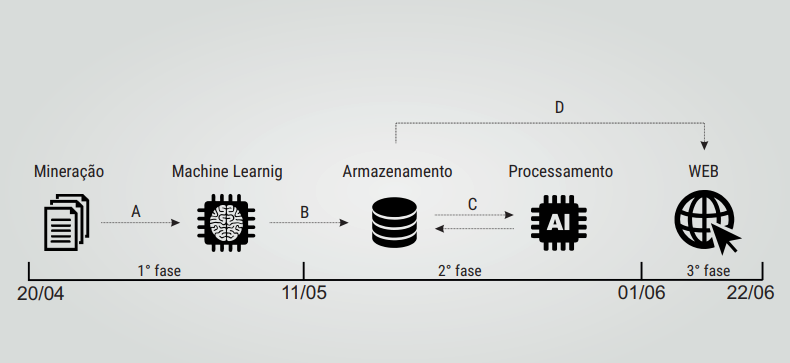

# Relatório do Olhar Cidadão - Projeto Transversal 2

## Introdução
O projeto *Olhar Cidadão* nasceu a partir de um brainstorming dos alunos de Engenharia de Redes de Comunicação da Universidade de Brasília durante a disciplina Projeto Transversal em Redes de Comunicação 2, ministrada pelo professor Dr. Flavio Elias de Deus.

O projeto seguiu as premissas definidas pelo PMBoK (Project Management Body of Knowledge do Project Management Institute). A partir de uma listagem inicial de problemas que seriam possíveis ser atacados pelo grupo, a escolhida foi identificar possíveis fraudes e suspeitas de corrupção ou desvio de dinheiro a partir da análise de licitações.

Baseando-se no conhecido projeto *Operação Serenata de Amor* (https://serenata.ai/), que utiliza a ciência dos dados para fiscalizar gastos públicos de deputados federais e senadores, o *Olhar Cidadão* tem o objetivo de fiscalizar gastos de orgãos públicos, como prefeituras e universidades federais, e facilitar o entendimento das pessoas interessadas em acompanhar tais gastos e para onde parte do dinheiro público está sendo direcionado.

Por conta do tamanho do Brasil, do número de orgãos públicos que existem, do número de pessoas na turma e do tempo disponível para a a disciplina, foi necessário limitar o escopo o projeto.

## Escopo
##### Definição do Escopo
Implementação de uma aplicação WEB que tenha funcionalidades estatísticas provenientes de um sistema de mineração de dados, para explorar os portais de transparência da Administração Pública, com objetivo de apresentar informações mais claras sobre as licitações para compras e contratações de serviços de órgãos do governo (previamente definidos).

##### Dentro do Escopo
- Os artefatos de extração serão desenvolvidos por scripts/códigos específicos.
- Coleta e tratamento de dados de licitações de órgãos previamente definidos.
- Comparar preços de produtos que foram adquiridos por licitações com produtos oferecidos online.
- Publicação dos resultados do tratamento estatístico das informações coletadas.

##### Fora do Escopo
- Implementação em todos os órgãos do governo.
- Mineração dinâmica de dados.
- Contestação de preços maiores do que oferecidos no mercado.

##### Preemissas
- A possibilidade de acessar dados abertos de licitações.
- Acesso às licitações das prefeituras da cidade de Brarreiras - BA e da Universidade de Brasília.

##### Restrições
- Falta de padrão em portais do governo.

## Cronograma
O projeto foi dividido em 4 grandes processos:

##### Processo A (20 a 27 de abril):
Realizar a obtenção dos dados (arquivos das licitações, seja em PDF, XML ou outros formatos) de maneira automática, dadas as páginas com os arquivos.

##### Processo B (27 de abril a 18 de maio):
Realizar a conversão dos arquivos obtidos em dados estruturados e armazenar aqueles de interesse (como nomes de empresas, descrição de produtos e servições e valores) em bancos de dados.

##### Processo C (18 de maio a 15 de junho):
Realizar uma busca na internet de cada produto citado numa licitação por meio de Web Scraping, e comparar o valor na licitação e o maior valor encontrado na busca. Se o valor da licitação ainda for maior que o maior valor dos resultados da pesquisa, esse produto se torna suspeito e é armazenado separadamente no banco de dados.

##### Processo D (15 de junho a 6 de julho):
Desenvolver uma API que permita que outras pessoas utilizem esse projeto e o banco de dados para exibir as informações em uma plataforma Web. Além disso, uma plataforma Web própria foi desenvolvida para mostrar os dados obtidos.

## Execução
##### Processo A (obtenção de dados):
Tarefa relativamente simples para o caso da UnB, mas houve alguns contratempos com as licitações de Barreiras, por conta de captchas e outros mecanismos que dificultaram a obtenção de dados de maneiras automática.

##### Processo B (conversão de dados não-estruturados em estruturados):
Tarefa que tomou mais tempo do que se imaginava. Diversas soluções encontradas não eram 100% acuradas ao transformar dados tabelados de documentos em dados estruturados, mas o resultado final foi bom. Ferramentas como o Watson da IBM foram testadas, mas infelizmente não serviram para o nosso propósito.

##### Processo C (Web Scrapping):
Tarefa que teve suas dificuldades, mas várias já eram esperadas. O resultado final se mostrou melhor do que imaginado. Foi possível comparar preços em sites como Buscapé, Zoom e Google Shopping.

##### Processo D:
Tarefa para criação da API e do aplicação Web que consumiria os dados do banco de dados utilizando a API implementada. 

## Encerramento
Foi entregue tudo aquilo descrito na seção Escopo. Foi possível identificar alguns valores suspeitos em licitações da prefeitura da UnB, em que buscas na internet revelaram sempre valores menores do que os oferecidos pela empresa vencedora da licitação, além de ser possível verificar o gasto por período de cada orgão público e um resumo de informações de cada empresa escolhida nas licitações analisadas.